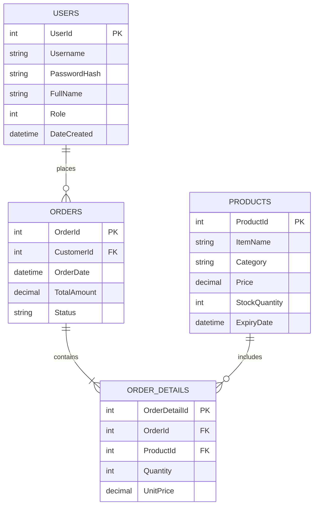

# 🍔 Burger Shop POS (Point of Sale System)

[](https://dotnet.microsoft.com/download/dotnet/8.0)
[](https://docs.microsoft.com/ef/core/)
[](https://www.microsoft.com/sql-server)
[](LICENSE)

A modern, responsive, and robust **Point of Sale (POS) & Restaurant Management System** built with **ASP.NET Core (.NET 8)**, **Entity Framework Core**, and **SQL Server**. Designed to streamline counter orders, automate receipt generation, and provide real-time sales analytics and inventory insights for burger joints and fast-food businesses.

---

## 📌 Table of Contents

- [Features](#-features)
  - [Cashier / POS Terminal](#-cashier--pos-terminal)
  - [Admin Dashboard & Analytics](#-admin-dashboard--analytics)
  - [Security & Access Control](#-security--access-control)
- [Tech Stack](#-tech-stack)
- [Project Architecture](#-project-architecture)
- [Database Schema](#-database-schema)
- [Getting Started](#-getting-started)
  - [Prerequisites](#prerequisites)
  - [Installation & Setup](#installation--setup)
  - [Database Migration & Seeding](#database-migration--seeding)
  - [Running the Application](#running-the-application)
- [Default Credentials](#-default-credentials)
- [Roadmap](#-roadmap)
- [License](#-license)

---

## ✨ Features

### 🛒 Cashier / POS Terminal (`/Sales`)
- **Fast Product Browsing:** Filter items across categories (*Burgers, Sides, Drinks, Desserts*).
- **Session-Based Cart:** Add, remove, increment, and decrement items with automatic subtotal, tax, and total calculation.
- **Instant Checkout:** Seamless order submission tied to active customer/order records.
- **Automated PDF Receipts:** Instant, professional receipt rendering and download powered by **iText7**.

### 📊 Admin Dashboard & Analytics (`/Admin/Dashboard`)
- **Real-Time KPI Cards:** Instant metrics for total revenue, today's sales, active orders, and low-stock alerts.
- **Revenue & Sales Reporting:** Track sales patterns, top-performing items, and order volume.
- **Inventory & Stock Management:** Monitor inventory levels with stock indicators to prevent stockouts.

### 🔐 Security & Access Control (`/Account`)
- **Cookie Authentication:** Secure cookie-based authentication with session timeout and sliding expiration.
- **Role-Based Authorization:** Segregation of duties ensuring cashiers only access the terminal and managers access reports.

---

## 🛠 Tech Stack

| Layer | Technology |
|---|---|
| **Framework** | ASP.NET Core 8.0 (Razor Pages) |
| **Language** | C# 12 |
| **Data Access / ORM** | Entity Framework Core 8.0 |
| **Database** | Microsoft SQL Server / LocalDB |
| **PDF Engine** | iText7 (v8.0.2) |
| **Frontend UI** | HTML5, CSS3, JavaScript, Bootstrap 5 |
| **Authentication** | ASP.NET Core Cookie Authentication |

---

## 📂 Project Architecture

```text
BurgerShopPOS/
│
├── Data/
│   └── AppDbContext.cs          # EF Core DbContext, relationships, and seed data
│
├── Migrations/                  # EF Core database migrations
│
├── Models/                      # Core domain entities
│   ├── User.cs                  # User entity & role flags (Admin, Cashier)
│   ├── Product.cs               # Menu item data, prices, categories, stock
│   └── Order.cs                 # Order & OrderDetail entities
│
├── Pages/                       # Razor Pages UI
│   ├── Account/                 # Authentication (Login, Logout)
│   ├── Admin/                   # Administration & Analytics Dashboard
│   ├── Sales/                   # Interactive POS Terminal & Cart
│   └── Shared/                  # Layouts, navigation, and validation scripts
│
├── Services/
│   └── InvoiceService.cs        # PDF receipt generation using iText7
│
├── ViewModels/                  # Data transfer models for cart & dashboard views
├── wwwroot/                     # Static files (CSS, JS, images, icons)
├── appsettings.json             # Application configurations
├── appsettings.Development.json # Development settings & SQL connection string
└── Program.cs                   # Application entry point, DI, and middleware pipeline
```

---

## 🗄 Database Schema

The database design contains the following core relational models:



---

## 🚀 Getting Started

### Prerequisites

Ensure you have the following installed on your machine:
- [.NET 8.0 SDK](https://dotnet.microsoft.com/download/dotnet/8.0)
- [SQL Server](https://www.microsoft.com/sql-server) or **SQL Server Express / LocalDB**
- [Visual Studio 2022](https://visualstudio.microsoft.com/) (with *ASP.NET and web development* workload) or [VS Code](https://code.visualstudio.com/)

---

### Installation & Setup

1. **Clone the repository:**
   ```bash
   git clone https://github.com/your-username/BurgerShopPOS.git
   cd BurgerShopPOS
   ```

2. **Configure Database Connection:**
   Open `appsettings.Development.json` and adjust the connection string to match your SQL Server instance:
   ```json
   {
     "ConnectionStrings": {
       "DefaultConnection": "Server=localhost\\SQLEXPRESS;Database=BurgerShopPOS;Trusted_Connection=True;TrustServerCertificate=True;"
     }
   }
   ```

3. **Restore Dependencies:**
   ```bash
   dotnet restore
   ```

---

### Database Migration & Seeding

Apply the initial Entity Framework Core migrations to create the database and seed initial menu items and users:

```bash
dotnet ef database update
```
*(Alternatively, in Visual Studio Package Manager Console: `Update-Database`)*

---

### Running the Application

Launch the application:
```bash
dotnet run
```

Access the application in your browser at:
`http://localhost:5289` or `https://localhost:7198`

---

## 🔑 Default Credentials

The database seeds the following default accounts for development and testing:

| Role | Username | Password | Default Redirect |
|---|---|---|---|
| **Admin** | `admin` | `admin123` | `/Admin/Dashboard` |
| **Cashier / Staff** | `cashier1` | `cashier123` | `/Sales/Index` |
| **Cashier / Staff** | `cashier2` | `cashier123` | `/Sales/Index` |

---

## 🗺 Roadmap

- [ ] Add barcode/QR scanner integration for checkout
- [ ] Multiple payment gateways (Cash, Card, Digital Wallets)
- [ ] Real-time kitchen display system (KDS) via SignalR
- [ ] Customer loyalty & discount coupon system
- [ ] Multi-branch / franchise management support

---

## 📄 License

This project is licensed under the **MIT License** - see the [LICENSE](LICENSE) file for details.
